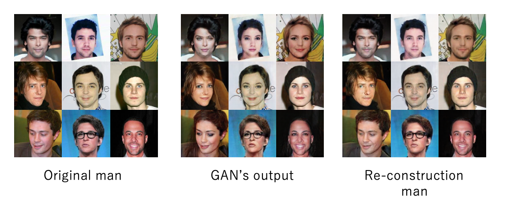
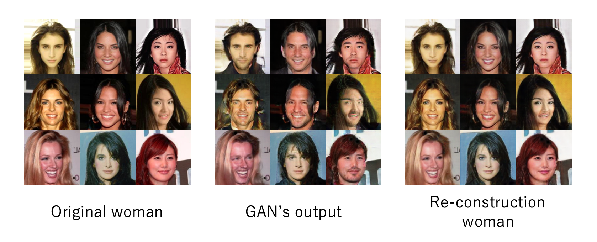

## result cycleGAN (Adversarial Loss is MSE + activation Sigmoid, cycle loss is MAE )
* ### man to woman


* ### woman to man


## datasets
* ### man's faces

    * https://drive.google.com/drive/folders/1x4aHhoZBOFkBmUsfk3KZRcO9kvyk0b3d?usp=sharing

    * It has about 3000 Images of man


* ### woman's faces

    * https://drive.google.com/drive/folders/1bTf2a70jX7YQkT8Q-6o8oKTqPFTlfIAJ?usp=sharing>

    * It has about 3000 Images of woman

## How to train

* If you want to download, please run below command


```
% git clone https://github.com/kokikurahashi/cycleGAN
``` 

* If you want to train, please run "python train.py" after changing directory to "cycleGAN"

```
% cd cycleGAN
% python train.py
``` 
